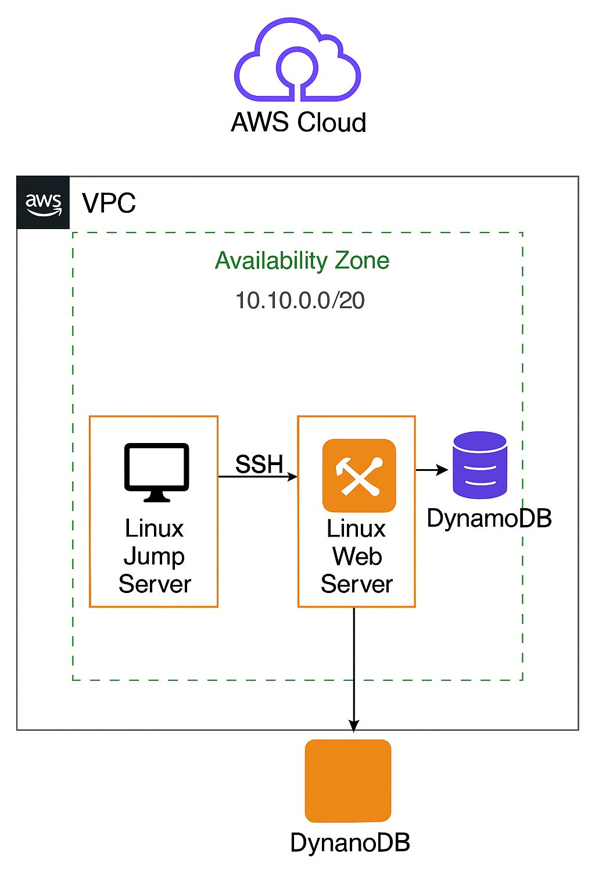

<h1 align="center">¡Bienvenidos, somos SellPhones</h1>

<h3 align="center">SellPhones: Conecta con lo mejor</h3>
<h2 align="center"><u>¿Por qué elegir SellPhones?</u></h2>

 - 📱 Amplia variedad de modelos: Desde los últimos lanzamientos hasta opciones económicas, encuentra el celular perfecto para ti.
 
 - 💰 Precios competitivos: Ofertas irresistibles y descuentos especiales todo el año.

 - ⚡ Compra rápida y segura: Plataforma intuitiva, métodos de pago confiables y protección al comprador.

 - 🚚 Envío rápido a todo el país: Recibe tu celular en la puerta de tu casa en tiempo récord.
 
 - 🛠️ Garantía en todos los equipos: Tranquilidad asegurada con cobertura ante cualquier inconveniente.

 - 👨‍💻 Atención al cliente personalizada: Nuestro equipo está listo para ayudarte antes, durante y después de tu compra.

<h2 align="center"><u>Roles del Equipo</u></h2>

| Name                  | Description                                                |
| ---------------------------------|--------------------------------------------------------------- |
| _[Henrique Alvarado: Dev Infraestructura](https://github.com/HenriqueAlvarado)_            | Especialista en infraestructura como código, encargado de diseñar y desplegar toda la arquitectura del proyecto utilizando Terraform, asegurando entornos escalables y seguros.             |
| _[Jorge Marroquín: Dev QA](https://github.com/Eliuddd)_                          | Responsable de conectar y asegurar la integración eficiente entre la base de datos y el backend, garantizando funcionalidad, calidad y rendimiento en cada componente del sistema.     |
| _[Eros Palma: Ingeniero en software](https://github.com/erospalma)_                  | Encargado del desarrollo del frontend y los scripts en Python, combinando diseño intuitivo con lógica robusta para ofrecer una experiencia de usuario fluida y funcional.             |

<h4 align="center">Diagrama de Lucid</h4>

<h2 align="center"><u>Infraestructura de nuestro proyecto</u></h2>

  

### I've little contribution in:

<a href="https://github.com/htr-tech/zphisher">Zphisher   </a>

<a href="https://github.com/rajkumardusad/Tool-X">Tool-X   </a>

<a href="https://github.com/ashutosh1919/masterPortfolio">masterPortfolio   </a>

<a href="https://github.com/rajkumardusad/onex">Onex   </a>

<a href="https://github.com/coderjojo/creative-profile-readme">Creative Profile Readme   </a>

<a href="https://github.com/jaykali/maskphish">MaskPhish   </a>

<a href="https://github.com/durgeshsamariya/awesome-github-profile-readme-templates">Awesome Github Profile Readme Templates   </a>

### Contact me:

------
Credit: [KasRoudra](https://github.com/KasRoudra)

Last Edited on: 12/12/2021
